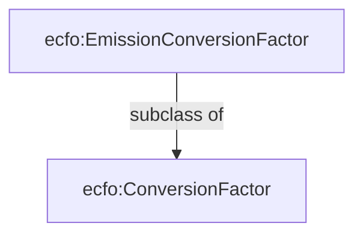
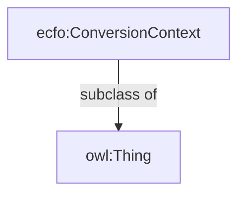
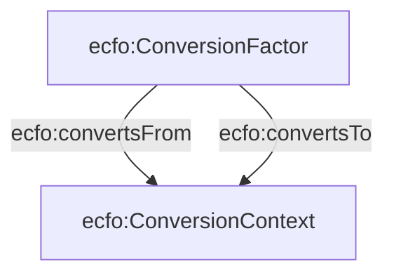
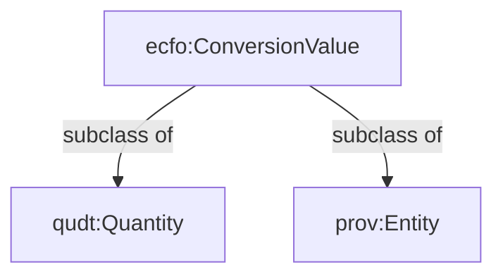
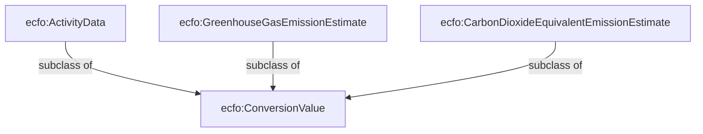
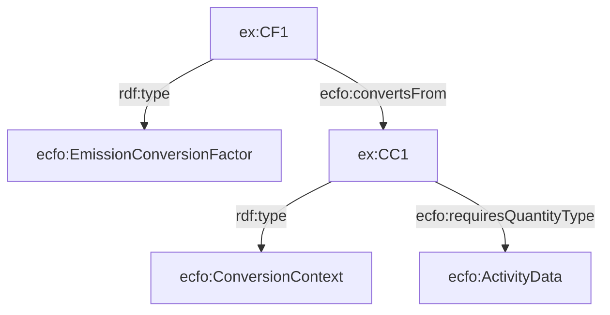
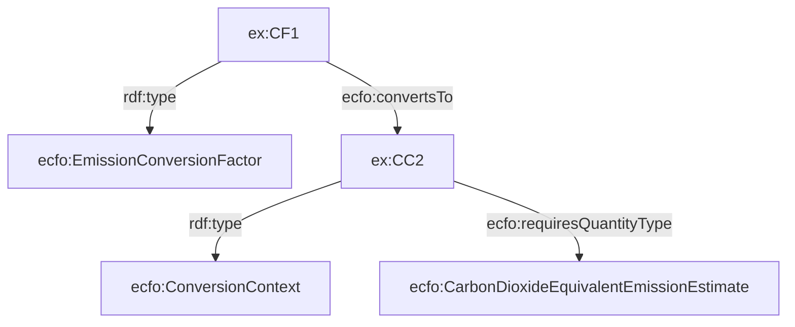
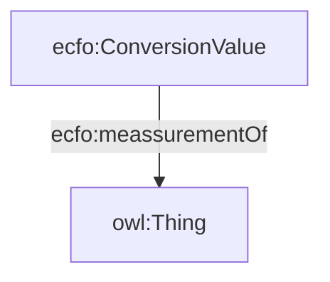
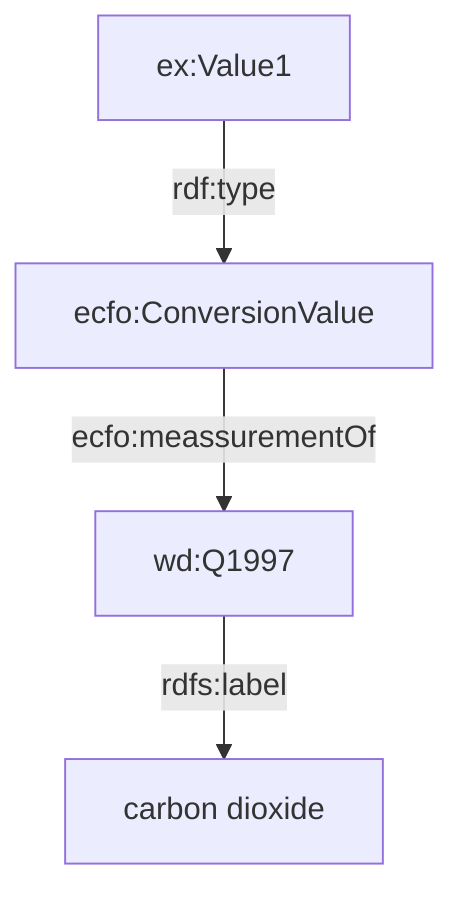
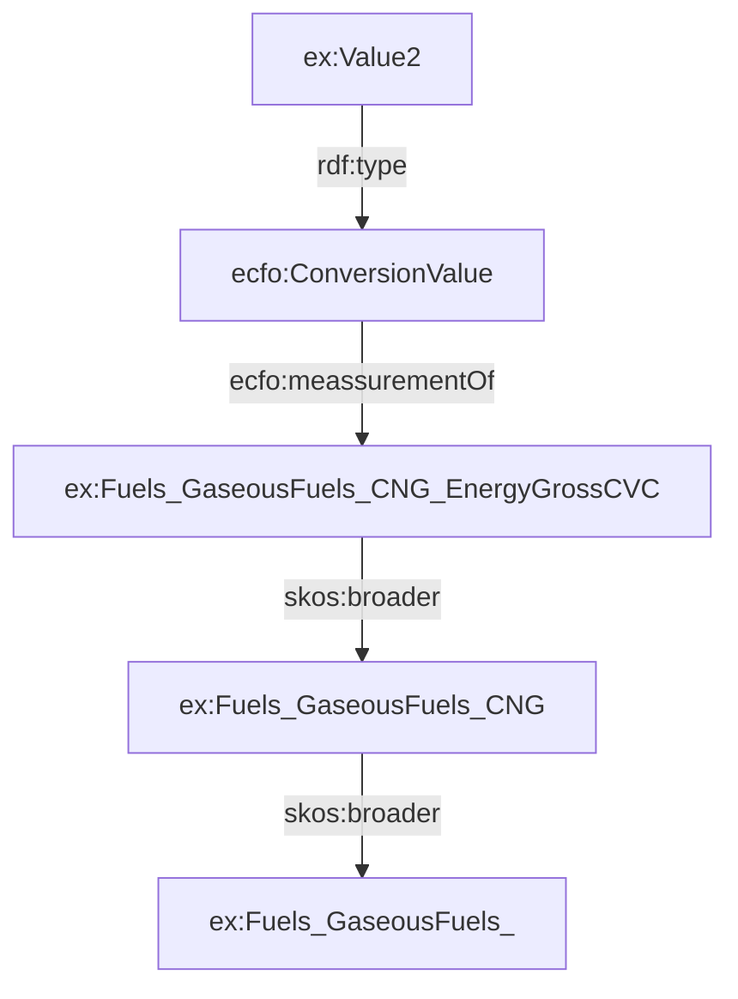

# ECFO V2

New or amended concepts

### ecfo:ConversionFactor

A new superclass ecfoEmissionConversion factor is added. This is to accomodate modelling of different types of conversion factors including those that do not produce emission estimates but are used in intermediary calculations. 

ecfo:EmissionConversionFactor is a subset of conversion factors that convert from activity data into emission estimates expressed either in the form of  GHG   emissions (e.g., CO2) or some impact metric (e.g., CO2e)

### Conversion Context

This is a utility concept that describes the quntities that the conversion factor converts and the quantities representing the results of the conversion. this applies to both inputs and outputs of the conversion process. 

Previous properties **ecfo:hasEmissionSource and ecfo:hasEmissionTarget** have been renamed to ecfo:convertsFrom and ecfo:convertsTo and are now linked to the conversion context

### Conversion Value

Conversion Value describes the type of the quantity that is being converted such as Activity Data, Raw GHG meassurement and Impact Metrics such as CO2 Equivalent. 

### Subclasses of ecfo:ConversionValue

#### ecfo:ActivityData

A meassure of the magnitude of a human activity resulting in emissions or removals taking place during a given period
of time. Data on energy use, metal production, land areas, management systems, lime and fertilizer use and waste arisings are examples of activity data.  Source:https://www.ipcc-nggip.iges.or.jp/public/2006gl/pdf/0_Overview/V0_2_Glossary.pdf

### ecfo:GreenhouseGasEmissionEstimate

An estimate of emissions expressed as a specific greenhouse gas. The Kyoto Protocol covers a basket of six greenhouse gases (GHGs) produced by human activities: carbon dioxide, methane, nitrous oxide, hydrofluorocarbons, perfluorocarbons and sulphur hexafluoride. 

### ecfo:CarbonDioxideEquivalentEmissionEstimate

CO2e equivalent is a metric measure used to compare the emissions from various [greenhouse gases](https://ec.europa.eu/eurostat/statistics-explained/index.php?title=Glossary:Greenhouse_gas_(GHG)) on the basis of their [global-warming potential (GWP)](https://ec.europa.eu/eurostat/statistics-explained/index.php?title=Glossary:Global-warming_potential_(GWP)), by converting amounts of other gases to the equivalent amount of carbon dioxide with the same global warming potential.

[Glossary:Carbon dioxide equivalent - Statistics Explained](https://ec.europa.eu/eurostat/statistics-explained/index.php?title=Glossary:Carbon_dioxide_equivalent)

### ecfo:requiresQuantityType

The property links ecfo:ConversionContext to the expected type of the quantity value that the conversion factor can be used to convert from and to (i.e., determined by the links ecfo:convertsFrom and ecfo:convertsTo)

Example: 

A conversion factor that converts from activity data to CO2equivalent

### 

### ecfo:meassurementOf

The propery links the ConversionValue to the concept describing what the value meassures - i.e. quantity of what?. QUDT ontology does not provide any suitable properies to represent this as the QuantityKind (used by ECFO v1) is actually supposed to represent the physical property of the quantity - e.g., mass, lenght, etc. In our ontology this description of quantity can be either a description of an element such as CO2 (e.g., using WIKIDATA) or a more abstract classification category such as those seen in the taxonomies of activity data (e.g., Natural Gas )

****Potential problem (See PECO ussage later in the document): calculation entities taht are not conversion values will not be able to be annotated with this property ****

For example, to represent that the quantity is the representation of quantity of CO2 gas we can link to wikidata entry describing carbon dioxide

To link the quantity value (e.g., activity data) to specific category we can do this as follows: 

**NOTE: TEC toolkit should contain KGs representing various taxonomies used to classify conversion factors such as IPCC, EPA, etc.**   

### ecfo:requiresMeassurementOf

The property links ecfo:ConversionContext to the expected concept representing what the value (to which this conversion factor can be applied to) meassures.

### Rationale

Why not just define subclasses of ecfo:ConversionValue to represent NaturalGas such as ecfo:ActivityData -> ex:NaturalGas? 

Categorisation taxonomies such as those used by the EPA, DENZ, IPCC do not create hierarchies that would conform to the strict semnatics of subclass of relationship with their parent elements. Therefore separating the specific type of the substance/concept from the quantitiy value allows for more flexible categorisations and linkage to other KGs such as wikidata. 

### ecfo:requiresQuantityKind

A property linking ecfo:ConversionContext to some Quantity Kind defined in the QUDT ontology (e.g. mass, volume, count).  

***Note: we could leverage property qudt:applicableUnit in the QUDT ontology to retrieve all the unit relevant to the specific quntity kind and automatically infer conversion factors for all combinations of relevant units. For example, a conversion factor converting from litres of fuel (activity data) to kg of CO2 could be converted into a conversion factor converting from mililiters to kg or cubic metres into tonnes, etc. ***

### ecfo:requiresUnit

Ussage with PECO

Calculation inputs and outputs that are linked to the conversion process are of type peco:CalculationEntity (subclass of prov:Entity and sosa:Observation). As the process documents also various intermediary steps (e.g. estimates of activity data from proxy observations) not all calculation entities represent emission estimate values or activity data. Those that represent these values can be marked by the appropriate ecfo:ConversionValue type that can then be used to look up compatible conversion factor.

Example:

### ecfo: ImpactMetric

### ecfo:OperationalBoundry

#### ecfo:LifecycleStage

### Uncertainity

### Modelling agregate conversion factors

### Open energy ontology alignments
