# ECFO V2

New or Amended Concepts

### ecfo:ConversionFactor

A new superclass, `ecfo:ConversionFactor`, is added. This is to accommodate modelling of different types of conversion factors, including those that do not produce emission estimates but are used in intermediary calculations.

`ecfo:EmissionConversionFactor` is a subset of conversion factors that convert from activity data into emission estimates, expressed either in the form of GHG emissions (e.g., CO2) or some impact metric (e.g., CO2e).

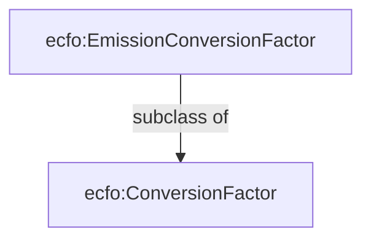

### Conversion Context

This is a utility concept that describes the quantities that the conversion factor converts and the quantities representing the results of the conversion. This applies to both inputs and outputs of the conversion process.

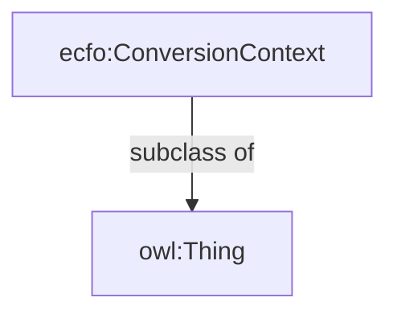

Previous properties `ecfo:hasEmissionSource` and `ecfo:hasEmissionTarget` have been renamed to `ecfo:convertsFrom` and `ecfo:convertsTo`, and are now linked to the conversion context.

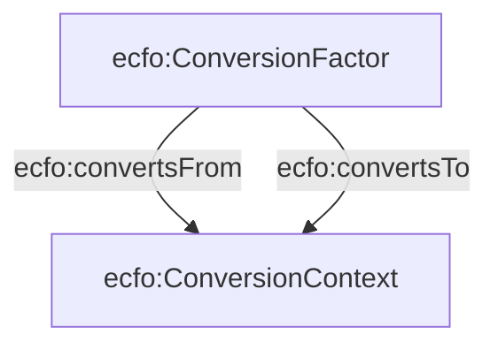

### Conversion Value

Conversion Value describes the type of the quantity that is being converted, such as Activity Data, raw GHG measurement, and Impact Metrics such as CO2 Equivalent.

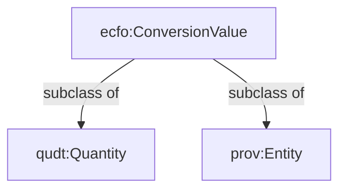

### Subclasses of ecfo:ConversionValue

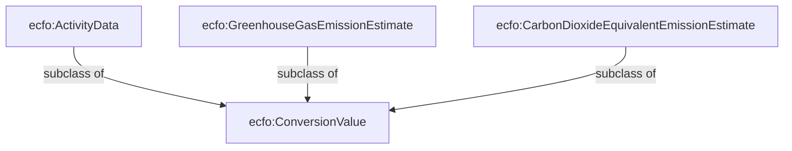

#### ecfo:ActivityData

A measure of the magnitude of a human activity resulting in emissions or removals taking place during a given period of time. Data on energy use, metal production, land areas, management systems, lime and fertilizer use, and waste arisings are examples of activity data.  
Source: https://www.ipcc-nggip.iges.or.jp/public/2006gl/pdf/0_Overview/V0_2_Glossary.pdf

### ecfo:GreenhouseGasEmissionEstimate

An estimate of emissions expressed as a specific greenhouse gas. The Kyoto Protocol covers a basket of six greenhouse gases (GHGs) produced by human activities: carbon dioxide, methane, nitrous oxide, hydrofluorocarbons, perfluorocarbons, and sulphur hexafluoride.

### ecfo:CarbonDioxideEquivalentEmissionEstimate

CO2e equivalent is a metric measure used to compare the emissions from various greenhouse gases based on their global-warming potential (GWP), by converting amounts of other gases to the equivalent amount of carbon dioxide with the same GWP.  
Source: https://ec.europa.eu/eurostat/statistics-explained/index.php?title=Glossary:Carbon_dioxide_equivalent

### ecfo:requiresQuantityType

This property links `ecfo:ConversionContext` to the expected type of quantity value that the conversion factor can be used to convert from and to (i.e., determined by the links `ecfo:convertsFrom` and `ecfo:convertsTo`).

Example: A conversion factor that converts from activity data to CO2 equivalent:

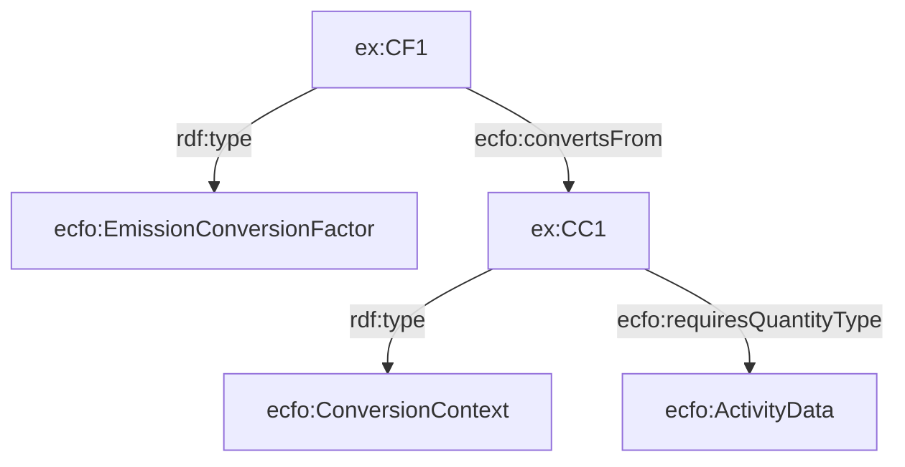

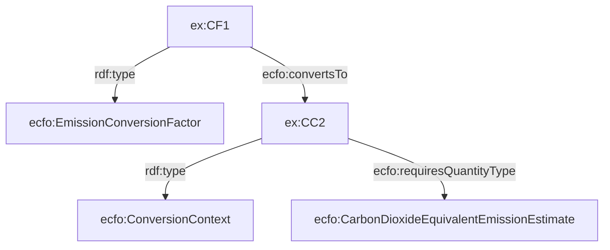

### ecfo:meassurementOf

This property links the `ecfo:ConversionValue` to the concept describing what the value measures — i.e., the quantity of what. The QUDT ontology does not provide any suitable properties to represent this, as the `QuantityKind` (used by ECFO v1) is actually supposed to represent the physical property of the quantity — e.g., mass, length, etc.

In our ontology, this description can either be a reference to a specific element (e.g., CO2 using Wikidata), or a more abstract category (e.g., Natural Gas).

**Potential issue:** Calculation entities that are not `ecfo:ConversionValue` cannot be annotated with this property.

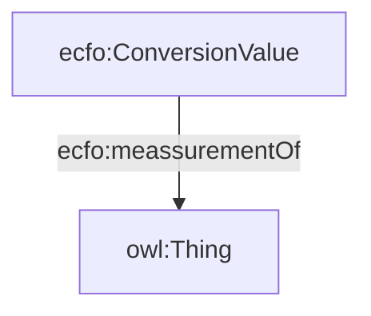

Example using Wikidata to describe carbon dioxide:

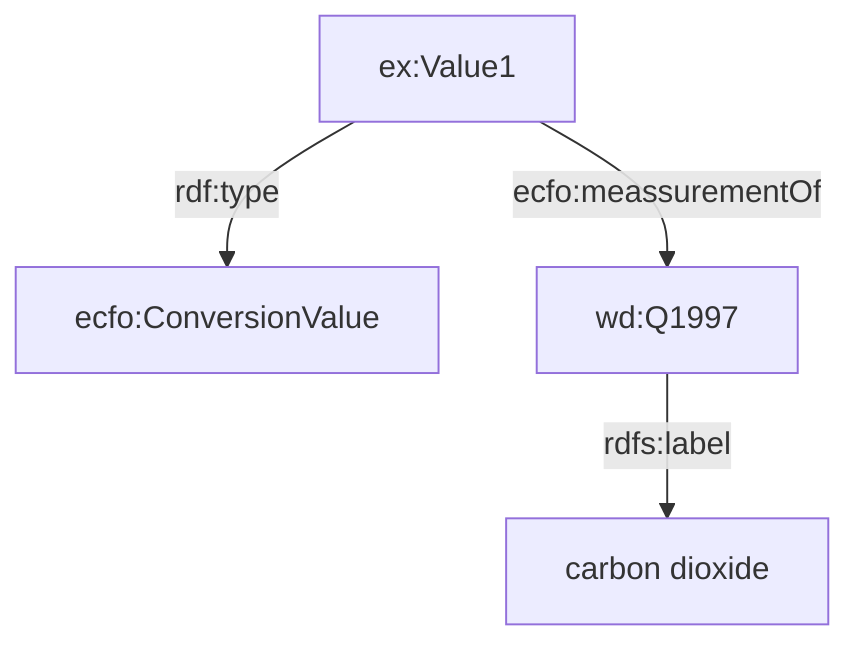

Linking quantity value to a category:

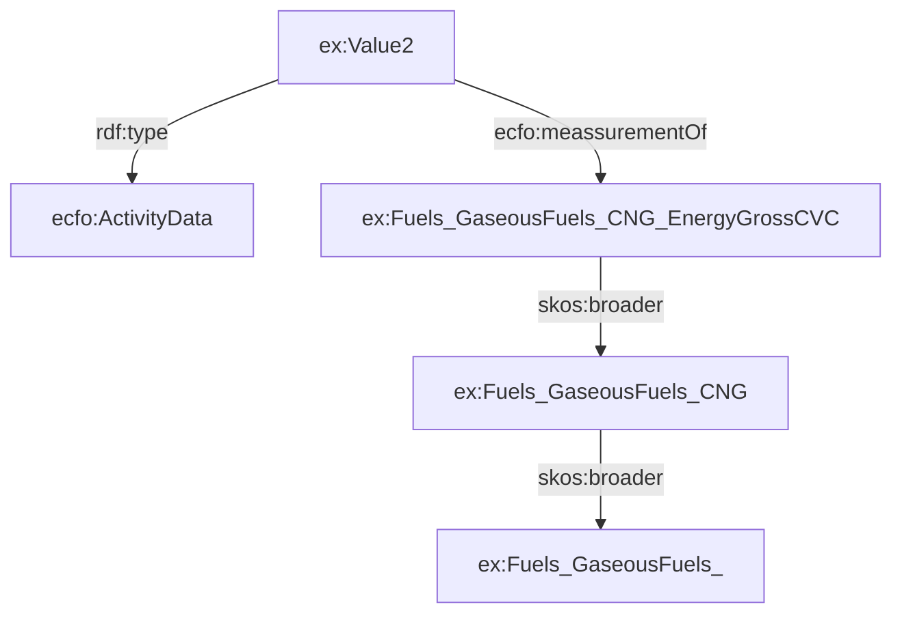

**NOTE:** The TEC toolkit should contain KGs representing various taxonomies used to classify conversion factors such as IPCC, EPA, etc.

### ecfo:requiresMeassurementOf

This property links `ecfo:ConversionContext` to the expected concept representing what the value (to which the conversion factor can be applied) measures.

### Rationale

Why not just define subclasses of `ecfo:ConversionValue` to represent concepts like `ex:NaturalGas`?

Because categorization taxonomies (e.g., EPA, DENZ, IPCC) often do not form strict subclass hierarchies. By separating the category from the quantity value, we allow for more flexible categorization and linking to external knowledge graphs like Wikidata.

### ecfo:requiresQuantityKind

This property links `ecfo:ConversionContext` to a `QuantityKind` defined in the QUDT ontology (e.g., mass, volume, count).

***Note:We could use `qudt:applicableUnit` to infer all relevant units for a given `QuantityKind`, enabling automatic generation of conversion factors between unit variations (e.g., liters ↔ milliliters ↔ cubic meters, etc.).**

### ecfo:requiresUnit

This property links `ecfo:ConversionContext` to a `Unit` defined in the QUDT ontology (e.g., mass, volume, count).

---

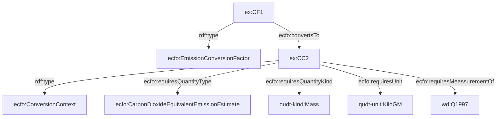

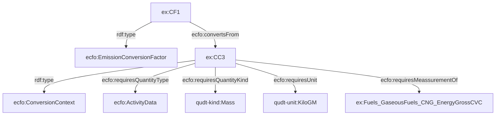

### Usage with PECO

Calculation inputs and outputs linked to the conversion process are of type `peco:CalculationEntity` (a subclass of `prov:Entity` and `sosa:Observation`). These include intermediary steps and not all represent emission values or activity data. Entities that do represent such values should be annotated with appropriate `ecfo:ConversionValue` subclasses.

---

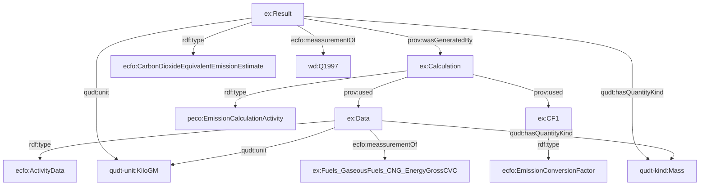

### Placeholder Sections

- ecfo:ImpactMetric
- ecfo:OperationalBoundary
- ecfo:LifecycleStage
- Uncertainty
- Modelling aggregate conversion factors
- Open energy ontology alignments

### Alignment of Quantity Values
