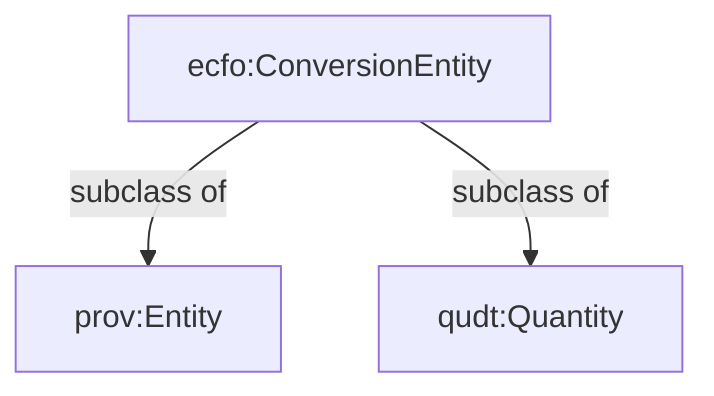

# ECFO V2
## Better QUDT Alignment

### ecfo:ConversionEntity

We introduce new concept ecfo:ConversionEntity that is a subclass of prov:Entitiy and qudt:Quantity. 


#### Ussage:

previous properties ecfo:hasEmissionSource and ecfo:hasEmissionTarget have been renamed to ecfo:converetsFrom and ecfo:convertsTo

```mermaid
 graph TD
    CF[ecfo:ConversionFactor]
    CE[ecfo:ConversionEntity]

    CF -- "ecfo:convertsFrom" --> CE
    CF -- "ecfo:convertsTo" --> CE
   ```

### Subclasses of ecfo:ConversionEntity
```mermaid 
graph TD
    CE[ecfo:ConversionEntity]
    AD[ecfo:ActivityData]
    GHG[ecfo:GreenhouseGas]
    CO2e[ecfo:CO2equivalent]

    AD -- "subclass of" --> CE
    GHG -- "subclass of" --> CE
    CO2e -- "subclass of" --> CE

```
#### ecfo:ActivityData
```
Data on the magnitude of a human activity resulting in emissions or removals taking place during a given period
of time. Data on energy use, metal production, land areas, management systems, lime and fertilizer use and
waste arisings are examples of activity data.  Source:https://www.ipcc-nggip.iges.or.jp/public/2006gl/pdf/0_Overview/V0_2_Glossary.pdf
```

This class defines the measurements used in emission calculations 
