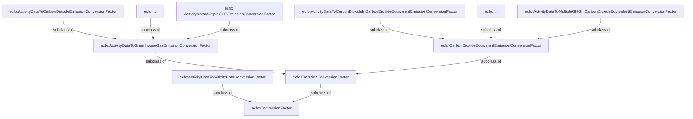

# ECFO V2

Motivating Scenarios: 

<u>**Scenario 1**</u>

Alice is responsible for collecting, verifying, and reporting the greenhouse gas emissions of ACME Company. To do this, she maintains a detailed list of activity data that quantify the company’s operations — such as the amount of petrol used by the car fleet, the electricity consumed by machinery, and other relevant resource usage across facilities. All of this information is manually recorded and organized in spreadsheets, which serve as the primary source for ACME’s emissions reporting. To prepare her report, Alice needs to determine which emission conversion factors can be applied to the data she already has; if no direct match exists, she must figure out what transformations or unit conversions are necessary so that her data aligns with the most recent regionally approved conversion factors. To support this task, she decides to use a semantic matching system powered by a conversion factors knowledge graph, modeled using the ECFO ontology. With this system, the units and types of her activity data are automatically mapped to the most relevant existing conversion factors, and in cases where intermediate data transformations are needed, the system suggests the appropriate conversions to make her data compatible. The candidate factors can also be filtered based on their key properties, such as issuing organization, regional context, or date of publication, ensuring that Alice applies the most suitable factors for her reporting context.

Potential CQs: 

- Which conversion factors can be applied to a given activity data record?

- What transformations or unit conversions are needed for my activity data to match the latest approved conversion factors?

- Which conversion factors are relevant for a specific region, issuing organization, or date of publication?

- Are there activity data records that do not have any suitable conversion factor available?

<u>**Scenario 2**</u>

Bob works for a regulatory body responsible for providing guidance to businesses on the proper use of emission conversion factors. His role involves reviewing and updating approved conversion factors, ensuring they reflect the latest scientific knowledge, regional policies, and methodological standards. Bob needs to identify instances where there have been significant changes in annually released conversion factors, as well as cases where different issuing organizations report substantially divergent values for the same year. Additionally, he wants to create comparative reports showing how the same conversion factors are applied across different countries — for example, comparing values used in Scotland versus New Zealand — to better understand regional variations and support harmonized guidance for international reporting.

Potential CQs: 

- Which conversion factors have changed significantly compared to the previous year?

- Which conversion factors differ substantially between issuing organizations for the same year?

- What are the properties of a given conversion factor (issuing organization, region, publication date, GWP assumptions)?

- How do conversion factors for the same activity compare across different countries (e.g., Scotland vs New Zealand)?

<u>**Scenario 3**</u>

Jack is responsible for analyzing the emissions reports submitted by businesses. These reports express emissions in CO₂-equivalent (CO₂e) values, but Jack wants to understand what portion of the reported results were calculated using conversion factors that convert from other greenhouse gases, such as methane or nitrous oxide. Where values were reported using aggregate conversion factors (e.g., combining different GHG) he want's to be able to quickly see the estimates for individual GHG portions recalculated using the associated conversion factors for single GHG. To ensure consistency in reporting, he also needs to verify that all these conversion factors were applied using the same Global Warming Potential (GWP) values. This enables Jack to detect discrepancies, identify potential misapplications of factors, and ensure that emissions comparisons across companies and regions are accurate and meaningful.

Potential CQs (these would also require full provenance of calculations (e.g., described using PECO) but let's assume we can pull a list of all CFs used in the report and we can link them to thier inputs and calculated results) : 

- What portion of reported CO₂e emissions comes from activity data converted from other GHGs (e.g., methane, nitrous oxide)?

- Which conversion factors were used for each GHG in the submitted reports?

- Were the same GWP values consistently applied across all conversion factors used in a report?

- Are there discrepancies in emissions calculations across reports for the same type of activity data?

- Which activity data or conversion factors could be responsible for anomalies in total reported CO₂e?

Not addressed in V1 : 

1) **Intermediate conversion factors converting from one activity data to another before the conversion factor can be applied**

Context: 

In greenhouse gas (GHG) accounting, energy statistics, and other environmental reporting systems, **activity data** refers to quantitative measures of human activities that lead to emissions or impacts — for example:

- **Fuel consumed** (liters of diesel, m³ of natural gas)

- **Distance traveled** (vehicle-km, passenger-km)

- **Electricity consumed** (kWh)

- **Production output** (tons of steel, number of widgets)

Sometimes you may have one form of activity data but need another form to apply the correct emission factor. In such cases, **conversion factors can be applied**. Examples:

- **Volume → Energy content:**  
  Convert liters of gasoline into gigajoules using its net calorific value (e.g., ~34.2 MJ/L).

- **Mass → Energy content:**  
  Convert tons of coal into TJ based on coal’s energy density.

- **Vehicle-km → Passenger-km:**  
  Multiply by average vehicle occupancy.

- **Production units → Mass:**  
  Convert number of items produced to total weight (if emissions factor is per kg).

These are essentially "activity-to-activity" conversions — not emissions factors, but intermediate conversions to express data in the units required for your inventory.

<u>**Relevant competency questions**</u>: 

Which conversion factor converts activity data from one set of units to another?

Which conversion factor converts from actvity data to emission estimates? 

Are there more relevant emission conversion conversion factors (e.g., based on geographic scope, date, etc. ) availabe if this activity data was converted into another set of units?   

2. **Incorrect use of qudt:hasQuantityKind**
   
   TBA

3. **Not recording the GWP values and the description of the specific GHG being meassured for factors converting into Co2e** 

Context: 

Without this information:

- It is unclear which GHG the factor applies to (e.g., CH₄, N₂O, SF₆).

- Please note that it must be possible to describe multiple GHG to cover the cases of aggregate conversion factors combining estimates of multiple gases into single CO2e result value 

- Users cannot verify or adjust conversions if GWP values are updated (e.g., between IPCC AR4, AR5, AR6).

Competency questions: 

If the result of the conversion is expressed in a comparative metric (e.g., CO₂e), which specific greenhouse gas (GHG) does this result estimate?

If the result of the conversion is expressed in a comparative metric (e.g., CO₂e), which Global Warming Potential (GWP) values were used by this conversion factor for each individual GHG?

4. TBA

New or Amended Concepts

### ecfo:ConversionFactor

A new superclass, `ecfo:ConversionFactor`, is added. This is to accommodate modelling of different types of conversion factors, including those that do not produce emission estimates but are used in intermediary calculations.

`ecfo:EmissionConversionFactor` is a subset of conversion factors that convert from activity data into emission estimates, expressed either in the form of GHG emissions (e.g., CO2) or some impact metric (e.g., CO2e).

### Conversion Context

This is a utility concept that describes the quantities that the conversion factor converts and the quantities representing the results of the conversion. This applies to both inputs and outputs of the conversion process.

Daniel: doesn't like conversion context

Previous properties `ecfo:hasEmissionSource` and `ecfo:hasEmissionTarget` have been renamed to `ecfo:convertsFrom` and `ecfo:convertsTo`, and are now linked to the conversion context.

Rationale: hasSource can be confused with link to the source of the conversion factor (i.e. provenance). Converts from and converts to should be clearer. 

### Conversion Value

Conversion Value describes the type of the quantity that is being converted, such as Activity Data, raw GHG measurement, and Impact Metrics such as CO2 Equivalent.

### Subclasses of ecfo:ConversionValue

Note: As the purpose of this structure is just to support Scenario 1 i.e. to differentiate between different conversion factors maybe it would make sense to have this rather as subclasses of conversion factor: 

Rationale for keeping the distinction between aggregate and single conversion factor at the class level -> if the distinction would be based on how many gasses are linked to the conversion factor and then the query would have to evaluate (e.g., via NOT Exists)  whetehr the CF covnerts only one or more GHG then thsi could affect scalability

#### ecfo:ActivityData

A measure of the magnitude of a human activity resulting in emissions or removals taking place during a given period of time. Data on energy use, metal production, land areas, management systems, lime and fertilizer use, and waste arisings are examples of activity data.  
Source: https://www.ipcc-nggip.iges.or.jp/public/2006gl/pdf/0_Overview/V0_2_Glossary.pdf

### ecfo:GreenhouseGasEmissionEstimate

An estimate of emissions expressed as a specific greenhouse gas. The Kyoto Protocol covers a basket of six greenhouse gases (GHGs) produced by human activities: carbon dioxide, methane, nitrous oxide, hydrofluorocarbons, perfluorocarbons, and sulphur hexafluoride.

### ecfo:CarbonDioxideEquivalentEmissionEstimate

CO2e equivalent is a metric measure used to compare the emissions from various greenhouse gases based on their global-warming potential (GWP), by converting amounts of other gases to the equivalent amount of carbon dioxide with the same GWP.  
Source: https://ec.europa.eu/eurostat/statistics-explained/index.php?title=Glossary:Carbon_dioxide_equivalent

### ecfo:requiresQuantityType

This property links `ecfo:ConversionContext` to the expected type of quantity value that the conversion factor can be used to convert from and to (i.e., determined by the links `ecfo:convertsFrom` and `ecfo:convertsTo`).

Example: A conversion factor that converts from activity data to CO2 equivalent:

### ecfo:meassurementOf

This property links the `ecfo:ConversionValue` to the concept describing what the value measures — i.e., the quantity of what. The QUDT ontology does not provide any suitable properties to represent this, as the `QuantityKind` (used by ECFO v1) is actually supposed to represent the physical property of the quantity — e.g., mass, length, etc.

In our ontology, this description can either be a reference to a specific element (e.g., CO2 using Wikidata), or a more abstract category (e.g., Natural Gas).

**Potential issue:** Calculation entities that are not `ecfo:ConversionValue` cannot be annotated with this property.

Example using Wikidata to describe carbon dioxide:

Linking quantity value to a category:

**NOTE:** The TEC toolkit should contain KGs representing various taxonomies used to classify conversion factors such as IPCC, EPA, etc.

### ecfo:requiresMeassurementOf

This property links `ecfo:ConversionContext` to the expected concept representing what the value (to which the conversion factor can be applied) measures.

### Rationale

Why not just define subclasses of `ecfo:ConversionValue` to represent concepts like `ex:NaturalGas`?

Because categorization taxonomies (e.g., EPA, DENZ, IPCC) often do not form strict subclass hierarchies. By separating the category from the quantity value, we allow for more flexible categorization and linking to external knowledge graphs like Wikidata.

### ecfo:requiresQuantityKind

This property links `ecfo:ConversionContext` to a `QuantityKind` defined in the QUDT ontology (e.g., mass, volume, count).

***Note:We could use `qudt:applicableUnit` to infer all relevant units for a given `QuantityKind`, enabling automatic generation of conversion factors between unit variations (e.g., liters ↔ milliliters ↔ cubic meters, etc.).**

### ecfo:requiresUnit

This property links `ecfo:ConversionContext` to a `Unit` defined in the QUDT ontology (e.g., mass, volume, count).

---

### Usage with PECO

Calculation inputs and outputs linked to the conversion process are of type `peco:CalculationEntity` (a subclass of `prov:Entity` and `sosa:Observation`). These include intermediary steps and not all represent emission values or activity data. Entities that do represent such values should be annotated with appropriate `ecfo:ConversionValue` subclasses.

---

### ecfo: GHGImpactMetric

This is a top level class to describe different impact metrics that can be used to calculate comparative values to assess impact accross different GHG gasses. 

A subclass ecfo:GlobalWarmingPotential defines one of the popular metrics for converting GHG to CO2e. 

Given that for each of the GHG there are multiple values for different GWP we define additional subclasses such as MethaneGWP with instances representing differrent impact values annotated with additional data proporties including ecfo:impactValue, ecfo:impactPeriod (in years) and ecfo:authoritySource

### Placeholder Sections

- ecfo:ImpactMetric
- ecfo:OperationalBoundary
- ecfo:LifecycleStage
- Uncertainty
- Modelling aggregate conversion factor

### Open energy ontology alignments

##### Alignment of Quantity Values

This section lists a potential alignments between ECFO and Open Energy Ontology 

Prefix: oeo:http://openenergy-platform.org/ontology/oeo/

1)
oeo:OEO_00000350 (quantity value) 
ecfo:ConversionValue

2)
oeo:OEO_00140083 (carbon dioxide equivalent quantity value)
ecfo: CarbonDioxideEquivalentEmissionEstimate

NOTE: OEO defines this value as "A carbon dioxide equivalent quantity is a greenhouse gas emission value that quantifies the combined effect of all emitted greenhouse gases by giving an equivalent amount of CO2 which would have the same effect on the climate." 

This might suggest that they model only value where all emissions of other gasses (e.g. CH4, N2O) are combined under one value using multiple corresponding GWP. 

3)
ecfo:GreenhouseGasEmissionEstimate
oeo:OEO_00340065 (greem house gas emission value)

Note: OEO also defines a subclass for CO2 emission value. We shoudl mayb econsider defining subclasses for other GHG types in our ontology. 

4)

oeo:OEO_00000148 (Emisison Factor)
ecfo:EmissionConversionFactor

Note: oeo:OEO_00000148 is a process attribute. we need to better understand what is the relationship between OEO process concept and ECFO concepts
