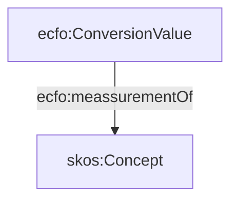

# ECFO V2

### Conversion Context

This is a utility concept that describes the quntities that the conversion factor converts. this applies to both inputs and outputs of the conversion process. 

### Ussage

Previous properties ecfo:hasEmissionSource and ecfo:hasEmissionTarget have been renamed to ecfo:converetsFrom and ecfo:convertsTo

## Better QUDT Alignment

ECFO v2 provides a better alignmnet with the QUDT ontology

### Conversion Value

Conversion Value describes the type of the quantity that is being converted such as Activity Data, Raw GHG meassurement and Impact Metrics such as CO2 Equivalent. 

### Subclasses of ecfo:ConversionValue

#### ecfo:ActivityData

Data on the magnitude of a human activity resulting in emissions or removals taking place during a given period
of time. Data on energy use, metal production, land areas, management systems, lime and fertilizer use and
waste arisings are examples of activity data.  Source:https://www.ipcc-nggip.iges.or.jp/public/2006gl/pdf/0_Overview/V0_2_Glossary.pdf

### ecfo:RawGHGMeassurement

### ecfo:CO2equivalent

### ecfo:requiresQuantityType

Property linking ecfo:ConversionContext with ecfo:QuantityValue to define the compatible types of quantities that the conversion factor can be applied to. 

Example:
A conversion factor that converts quantities representing activity data

### changing ecfo:hastag to ecfo:hasCategory

The ecfo:hasCategory property links the ecfo:ConversionValue to the description of the substance/concept the quantiy represents (i.e., quantity of what). The property replaces the ecfo:hasTag property and also changes the domain from ecfo:EmissionConversionFactor to qudt:Quantity. 

### ecfo:requiresQuantityType

The property links ecfo:ConversionContext to the expected type of the quantity value that the conversion factor can be used to convert from and to (i.e., determined by the links ecfo:convertsFrom and ecfo:convertsTo)

Example: 

A conversion factor that converts from activity data to CO2equivalent

### 

### ecfo:meassurementOf

The propery links the ConversionValue to the concept representing what the value meassures - i.e. quantity of X. QUDT ontology does not provide any suitable properies to represent this as the QuantityKind (used by ECFO v1) is actually supposed to represent the physical property of the quantity - e.g., mass, lenght, etc. 

****Potential problem (See PECO ussage later in the document): calculation entities taht are not conversion values will not be able to be annotated with this property ****

### ecfo:requiresMeassurementOf

The property links ecfo:ConversionContext to the concept representing what the value (to which this conversion factor can be applied to) meassures.

### Rationale

Why not just define subclasses of ecfo:ConversionValue to represent NaturalGas such as ecfo:ActivityData -> ex:NaturalGas? 

Categorisation taxonomies such as those used by the EPA, DENZ, IPCC do not create hierarchies that would conform to the strict semnatics of subclass of relationship with their parent elements. Therefore separating the specific type of the substance/concept from the quantitiy value allows for more flexible categorisations and linkage to other KGs such as wikidata. 

### Ussage with PECO

Calculation inputs and outputs that are linked to the conversion process are of type peco:CalculationEntity (subclass of prov:Entity and sosa:Observation). As the process documents also various intermediary steps (e.g. estimates of activity data from proxy observations) not all calculation entities represent emission values or activity data. Those that represent thesevalues can be marked by the appropriate ecfo:ConversionValue type that can then be used to look up compatible conversion factor. 

Example: 
